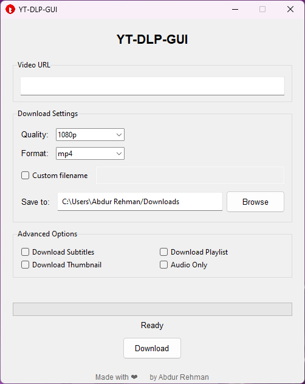

# yt-dlp-gui

**yt-dlp-gui** is a graphical user interface (GUI) for the powerful `yt-dlp` command-line tool, designed to help you easily download videos, audio, and playlists from YouTube and other video-sharing platforms. With a sleek and modern interface, you can easily customize video quality, format, output directory, and more, all without typing any complex commands.

<p align="center">
    
</p>

## Features

- **User-Friendly GUI**: A simple and modern interface built with `tkinter`.
- **Supports Multiple Formats**: Download videos in `mp4`, `webm`, `mp3`, `m4a`, `flac`, `wav`, and more.
- **Customizable Quality**: Choose from various video resolutions (e.g., 2160p, 1080p, 720p, 480p, etc.).
- **Download Playlists**: Download entire YouTube playlists with ease.
- **Subtitles and Thumbnails**: Option to download subtitles and thumbnails along with the video.
- **Audio-Only Mode**: Extract audio in the best quality, perfect for music lovers.
- **Custom File Naming**: Set your own custom filenames for downloads.
- **Cross-Platform**: Works on Windows, macOS, and Linux.

## Download

You can download the latest release of the **yt-dlp-gui** executable for Windows from the [Releases Page](https://github.com/abdurrehman0206/yt-dlp-gui/releases).

## Installation

To use **yt-dlp-gui**, follow these steps:

### Prerequisites

- Python 3.x (preferably 3.7 or higher)
- `yt-dlp` library
- `tkinter` (comes pre-installed with Python)

### Steps

1. **Clone the repository**:

   ```bash
   git clone https://github.com/abdurrehman0206/yt-dlp-gui.git
   
2. **Navigate to the project directory**:

   ```bash
   cd yt-dlp-gui

3. **Install required dependencies**:

   You will need `yt-dlp` which can be installed via `pip`:

   ```bash
   pip install yt-dlp

4. **Run the app**:

   Once everything is set up, simply run the `yt-dlp-gui.py` file:

   ```bash
   python yt-dlp-gui.py

This will launch the GUI where you can start downloading videos!

## Usage

1. **Enter the YouTube URL**: Paste the URL of the video or playlist you want to download in the "Video URL" field.
2. **Select Quality and Format**: Choose the desired video quality (e.g., 1080p, 720p) and format (e.g., mp4, mp3).
3. **Set Output Directory**: You can either type in a directory or browse to select a location where the downloaded files will be saved.
4. **Advanced Options**: You can choose to download subtitles, thumbnails, or audio-only files.
5. **Click Download**: Hit the "Download" button to start the download process. The progress bar will show the download status.

## Screenshots

Here are some screenshots of the app in action:

- 

## Contributing

Contributions to **yt-dlp-gui** are welcome! If you'd like to contribute, feel free to:

1. Fork the repository
2. Create a new branch for your feature or bug fix
3. Make your changes
4. Submit a pull request with a clear description of what you've done

### Issues & Bug Reports

If you encounter any bugs or have suggestions for improvements, please open an issue on the [GitHub Issues page](https://github.com/abdurrehman0206/yt-dlp-gui/issues).

---

Made with ❤️ by [Abdur Rehman](https://github.com/abdurrehman0206).
